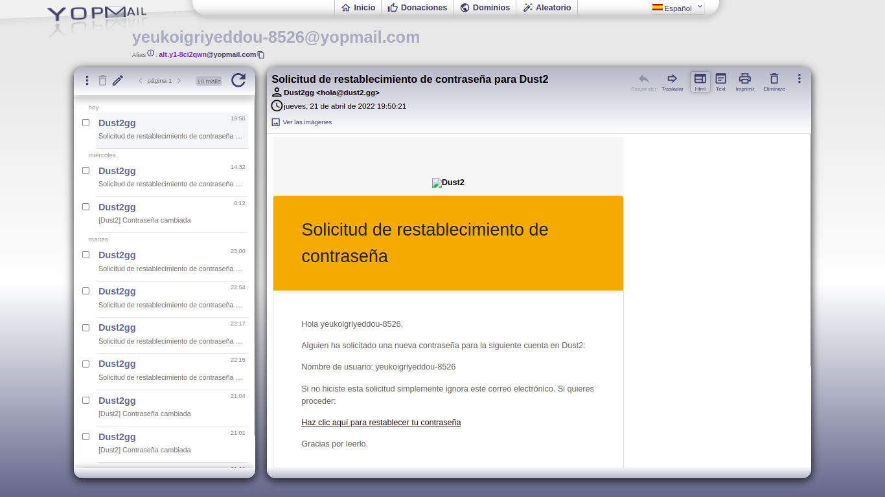
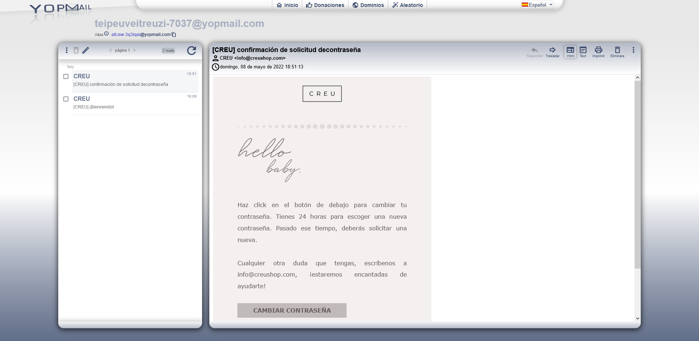

Actividad 2 - Hito 3: Criptografia y seguridad en redes
===============
- En este Hito, el/la estudiante deberá auditar la implementación de los sistemas de creación, actualización, acceso, transmisión y recuperación de contraseñas de 2 los dos sitios elegidos en los hitos anteriores (uno de uso exclusivo para usuarios chilenos y uno para usuarios pertenecientes a la comunidad europea), automatizando el proceso mediante el uso del lenguaje de programación a su elección.

- Para esto, deberá implementar un código en el lenguaje que usted estime conveniente, para automatizar lo siguiente:
>
> - Creación de una cuenta.
> - Inicio de sesión.
> - Restablecimiento de contraseña (no requiere login del usuario).
> - Modificación de contraseña (requiere login del usuario).
> 

## Desarrollo del Hito

- Para la creación de la automatizacion se utilizo `python` junto con una libreria llamanda `selenium`.
- Gracias a esta libreria, se puede lograr ejectuar una version de prueba de Google Chrome y controlarla mediante codigo.
- Tambien, se utilizo [YOPmail](https://yopmail.com/es/), que nos permite la creacion de un correo temporal y el posterior ingreso a la bandeja de entrada sin mayor complicacion.

### Pagina Chilena 

- La pagina chilena utilizada en este ejercicio es [Dust2](https://dust2.gg/), la que nos permite la creacion de un usuario, modificar la contraseña posterior al inicio de sesion, cambiar la contraseña via Mail sin ningun mayor problema.
- En cuanto a la ejecucion del codigo se tiene
  - Primero se debe ejecutar el archivo **Dust2Register**, ya que este se registra en la pagina y en archivo de texto **UsersD2** guarda el correo y la contraseña de este usuario. 
  - Posteriormente, ya se pueden ejecutar el resto de archivos sin ningun mayor problema.
  - El archivo **Dust2Login** realiza un inicio de sesion en la pagina con un usuario aleatorio desde el archivo de texto.
  - De igual forma **Dust2ResetPsw**, realiza un cambio de contraseña de un usuario perteneciente al archivo de texto. La nueva contraseña a utilizar se genera de manera aleatoria, con un largo especifico de 20 caracteres y se reemplaza por la contraseña anterior en **UsersD2**. A su vez, debido a requisitos de la pagina, a este usuario se le debe registar un nombre y apellido para realizar el cambio de contraseña siempre y cuando no se halla ingresado anteriormente. De ser así, se le registra con el nombre de Bender Bendig Rodriguez. 
  - Como ultimo punto, **Dust2ResetPswMail** realiza una solicitud de cambio de contraseña mediante correo electronico.

### Pagina Europea 
===============

- La pagina Europea utilizada fue [Creu](https://www.creushop.com/es/), la cual se encuentra sitiada en España.
- Al igual que en el caso de la Pagina Chilena:
  - Primero se debe ejecutar el archivo **CreuRegister**, ya que este se registra en la pagina y en archivo de texto **UsersCreu** guarda el correo y la contraseña de este usuario. Al momento de realizar un registro, se solicita un nombre y apellido del usuario. Ante esto se registra como Bender Rodriguez.
  - Posteriormente, ya se pueden ejecutar el resto de archivos sin ningun mayor problema.
  - El archivo **CreuLogin** realiza un inicio de sesion en la pagina con un usuario aleatorio desde el archivo de texto.
  - De igual forma **CreuResetPsw**, realiza un cambio de contraseña de un usuario perteneciente al archivo de texto. La nueva contraseña a utilizar se genera de manera aleatoria, con un largo especifico de 20 caracteres y se reemplaza por la contraseña anterior en **UsersCreu**.
  - Como ultimo punto, **CreuResetPswMail** realiza una solicitud de cambio de contraseña mediante correo electronico.
 
 
